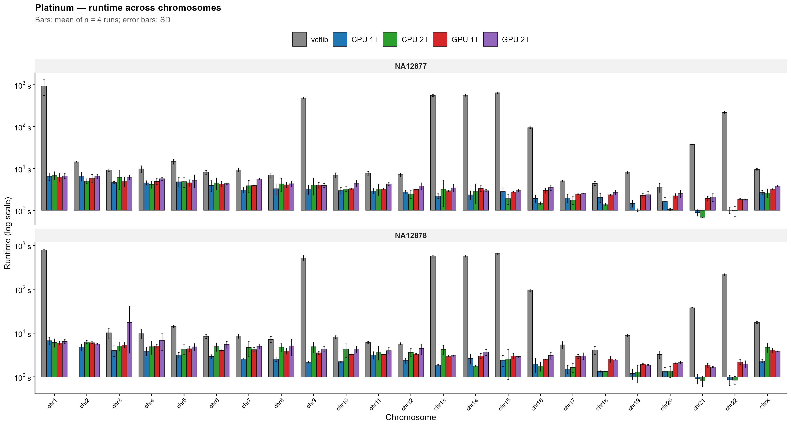
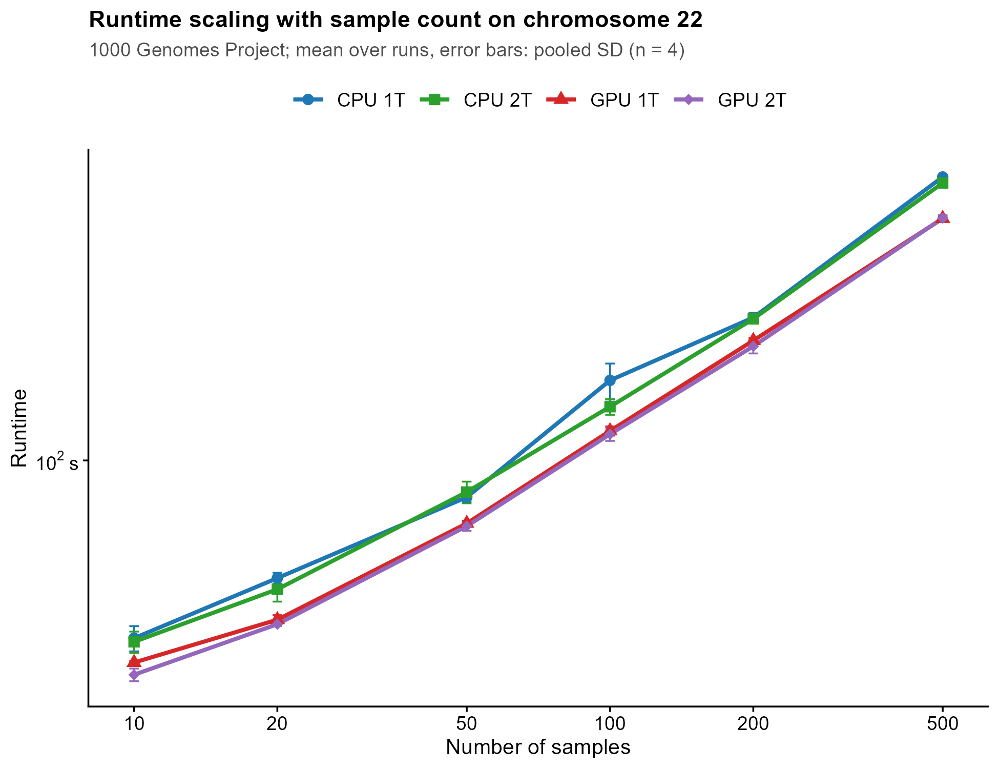
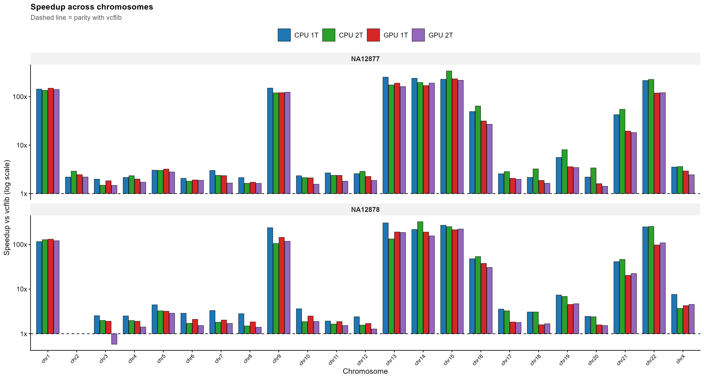
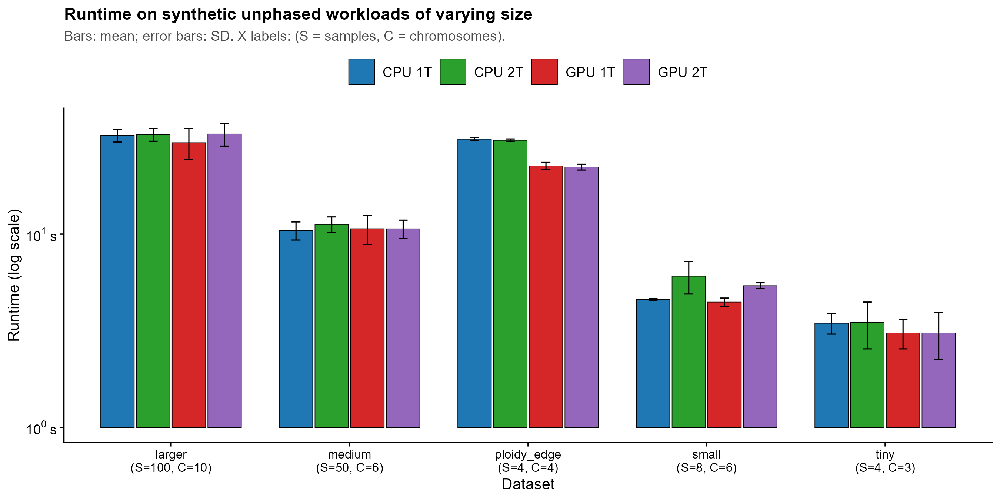
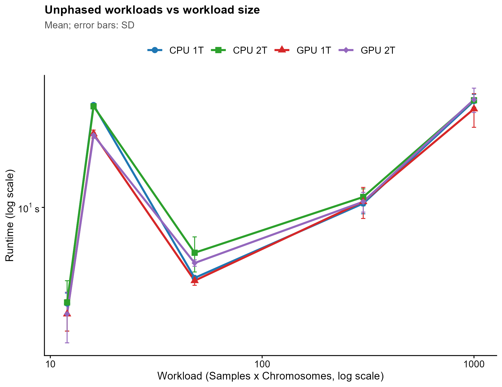
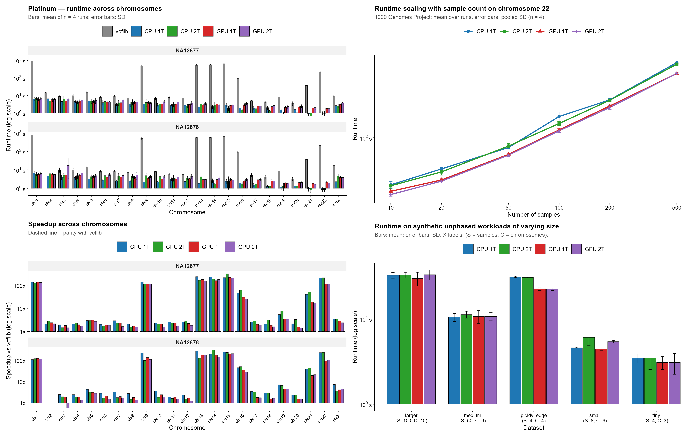

# Benchmark Results for vcf2fasta-rust

This document presents the four benchmark figures, describes the methodology behind each, and explains how to read them.

Figures are regenerated from the raw result spreadsheets by `tests/benchmark/scripts/plot_benchmark_results.R` (see [Benchmarking Guide §4.6](BENCHMARKING.md#46-plot_benchmark_resultsr--regenerate-all-figures)) and committed to `docs/figures/`.

---

## Test environment

All benchmark numbers were collected on a **Google Colab** instance (free tier, GPU runtime). This is a modest machine and the numbers reflect that; they are intended to demonstrate *relative* behaviour (Rust vs vcflib; CPU vs GPU; scaling shape) rather than absolute throughput on a production server.

| Property | Value |
|----------|-------|
| Platform | Google Colab (GPU runtime) |
| CPU | 2 vCPUs (Intel Xeon, shared) |
| RAM | 12.7 GB |
| GPU | NVIDIA Tesla T4, 16 GB VRAM |
| Number of GPUs used | 1 (device 0) |
| Driver / CUDA | 12.x (Colab-provided) |
| OS | Ubuntu 22.04 |
| Storage | Colab's virtual disk (network-backed, not NVMe) |
| Rust binary | `cargo build --release --features cuda` |
| vcflib version | `vcf2fasta` from `vcflib` (conda-forge / bioconda) |
| Beagle | `beagle-5.5_27Feb25.75f-0` |
| WhatsHap | conda-forge build |
| Number of runs per configuration | n = 4 |

### Single-GPU caveat

Every GPU number in Figures 1–4 was collected on a single NVIDIA Tesla
T4 (device 0). `--gpu-devices` was **not** exercised in this benchmark
run; the tool at that time resolved GPU work to device 0 regardless of
that flag. Multi-GPU scaling is therefore not characterised by these
figures.

To produce multi-GPU numbers, re-run
`tests/benchmark/scripts/scaling_benchmark.sh` with
`GPU_DEVICES=0,1` (or a larger prefix on a machine with more GPUs) and
regenerate the corresponding workbook. Because the tool's multi-GPU
implementation distributes tile-level work within a single contig, the
gain is bounded by `tiles_per_contig × tiles_large_enough_to_matter`;
small cohorts or short contigs will see little to no benefit.

Note also that the Rust tool's output is device-count-independent: the
kernel is deterministic per batch and the ordered collector
re-establishes tile order regardless of which device produced which
tile. `compare_summary.tsv` should therefore be identical between
single-GPU and multi-GPU runs of the same input.

### What this machine means for the results

1. **Only 2 vCPUs.** `CPU 1T` and `CPU 2T` are the only meaningful CPU configurations. There is no `CPU 4T` or `CPU 8T` column.

2. **Shared, network-backed storage.** Colab's disk is not local NVMe. This inflates all I/O-bound stages and adds variance between runs. Error bars on I/O-heavy configurations (especially high-sample-count runs that write many output files) will be visibly wider than on a machine with local storage.

3. **Tesla T4 with 16 GB VRAM.** Plenty of VRAM for the workloads tested, but modest compute throughput by modern standards. GPU runs are competitive with CPU on medium-to-large workloads; on tiny workloads the fixed kernel-compile + transfer overhead makes GPU *slower* than CPU.

4. **Colab session limits.** Long-running configurations (particularly vcflib on large datasets) risk being killed by the session watchdog before the external timeout fires. Rows marked `TIMEOUT` include both the script-enforced timeout and any session-limit kill.

---

## Figure 1 — Platinum: runtime across chromosomes



*Bars: mean of n = 4 runs; error bars: SD. Generated by `plot_benchmark_results.R`.*

**What it shows.** Wall-clock runtime for the Platinum Genomes samples (NA12877, NA12878) on each chromosome, across five configurations:

- `vcflib` — official C++ `vcf2fasta` as the baseline
- `CPU 1T` — Rust, `--device cpu --threads 1`
- `CPU 2T` — Rust, `--device cpu --threads 2`
- `GPU 1T` — Rust, `--device gpu --threads 1`
- `GPU 2T` — Rust, `--device gpu --threads 2`

All GPU configurations use a single device (see the Single-GPU caveat above).

**Presentation.** Grouped bar chart with one panel per sample (`facet_wrap(~ Sample, ncol = 1, scales = "free_y")`). Within each panel, the x-axis is chromosome and the y-axis is runtime on a log-10 scale with power-of-10 breaks (0.1 s, 1 s, 10 s, 100 s, 1000 s).

---

## Figure 2 — Runtime scaling with sample count (chr22, 1000 Genomes)



*Mean over runs; error bars: pooled SD (n = 4). Generated by `plot_benchmark_results.R`.*

**What it shows.** Wall-clock runtime on 1000 Genomes chr22 as the number of samples increases from 10 to 500, across four Rust configurations:

- `CPU 1T`, `CPU 2T`, `GPU 1T`, `GPU 2T`

All GPU configurations use a single device (see the Single-GPU caveat above).

**Presentation.** Log-log line chart with one line per configuration. X-axis: 10, 20, 50, 100, 200, 500 samples. Y-axis: runtime on log-10 scale with power-of-10 breaks. Each point is the mean over n = 4 runs; error bars are the pooled standard deviation.

---

## Figure 3 — Speedup across chromosomes



*Bars: mean speedup vs vcflib; dashed line = parity. Generated by `plot_benchmark_results.R`.*

**What it shows.** Speedup of each Rust configuration over the vcflib baseline, chromosome by chromosome, faceted by sample.

All GPU configurations use a single device (see the Single-GPU caveat above).

**Presentation.** Grouped bar chart with one panel per sample, log-10 y-axis with breaks at 1×, 10×, 100×, 1000×. A horizontal dashed line at y = 1.0 marks parity with vcflib; points above the line are faster.

---

## Figure 4 — Runtime on synthetic unphased workloads



*Bars: mean; error bars: SD. X labels: (S = samples, C = chromosomes). Generated by `plot_benchmark_results.R`.*

**What it shows.** End-to-end runtime of the integrated pipeline (phasing → vcf2fasta) on the five synthetic datasets generated by `generate_synthetic_datasets.sh`:

- `tiny` — 4 samples, 3 chromosomes, 1 000 variants/chromosome
- `small` — 8 samples, 6 chromosomes, 1 500 variants/chromosome
- `medium` — 50 samples, 6 chromosomes, 2 200 variants/chromosome
- `larger` — 100 samples, 10 chromosomes, 3 000 variants/chromosome
- `ploidy_edge` — 4 samples, 4 chromosomes, 1 200 variants/chromosome, with ploidy changes

All GPU configurations use a single device (see the Single-GPU caveat above).

**Presentation.** Grouped bar chart with one group per dataset. X-axis labels have the form `<dataset>\n(S=<samples>, C=<chromosomes>)`. Log-10 y-axis with breaks at 1 s, 10 s, 100 s, 1000 s.

**What to look for.**

1. **Phasing dominates.** Unlike Figures 1–3, this benchmark includes phasing. On Colab's 2 vCPUs, Beagle and WhatsHap are the bottleneck.
2. **Beagle vs WhatsHap.** `tiny` and `ploidy_edge` exercise different backends. `ploidy_edge` invokes the variable-ploidy pipeline (WhatsHap per constant-ploidy run + merge), which is the most expensive path.
3. **Scaling across datasets.** Time should increase monotonically from `tiny` → `small` → `medium` → `larger`. `ploidy_edge` sits outside the monotone sequence because its workload profile differs.
4. **GPU vs CPU.** On unphased input, the phasing subprocess runs on CPU regardless of `--device`. Only the vcf2fasta stage is GPU-accelerated. Expect the GPU gap to shrink compared to Figures 1–2, and possibly be negligible when phasing dominates.
5. **Thread effects.** With only 2 vCPUs, `CPU 2T` can help phasing but cannot fully overlap phasing with vcf2fasta.

### Supplementary figure — workload size on X



*Same data as Figure 4, but with `Samples × Chromosomes` on the x-axis (log scale). Useful for checking whether total workload is the dominant driver of runtime.*

---

## Combined figure



*Panel A = Figure 1 (Platinum runtime); Panel B = Figure 3 (speedup); Panel C = Figure 2 (scaling); Panel D = Figure 4 (unphased). Generated by `plot_benchmark_results.R`.*

---

## Reading the four figures together

- **Figures 1 and 3 (Platinum)** isolate the **vcf2fasta stage** on already-phased input. They answer: *"How much faster is the Rust tool than vcflib on real WGS data?"*
- **Figure 2 (1000G chr22)** isolates **sample-count scaling** on a single already-phased chromosome. It answers: *"Does the tool scale with cohort size, and where does GPU overtake CPU?"*
- **Figure 4 (synthetic unphased)** measures the **full pipeline** including phasing. It answers: *"What does an end-to-end user actually pay, and how much of that is phasing vs. vcf2fasta?"*

The three claims these figures support:

1. **Correctness.** The Rust tool produces byte-identical FASTA to the official `vcf2fasta` — verified separately by `run_benchmark.sh` with `USE_VCFLIB=true`.
2. **Raw speed on the vcf2fasta stage.** Figures 1 and 3 show a consistent, large speedup over vcflib on every chromosome tested, on the same 2-vCPU hardware.
3. **Scaling.** Figure 2 shows the tool handles cohorts from 10 up to 500 samples without super-linear blow-up.

These figures do **not** characterise multi-GPU scaling; see the
Single-GPU caveat above.

---
## Correctness evidence — `compare_summary.tsv`

The four figures show *how fast* the tool runs. They do not show
*whether it produces correct output*. That evidence lives in a single
committed file: [`tests/benchmark/results/compare_summary.tsv`](../tests/benchmark/results/compare_summary.tsv),
written by `run_benchmark.sh` when `USE_VCFLIB=true`.

The file records one row per `(sample, chromosome, haplotype)` and, for
each, compares the Rust tool's FASTA length against vcflib's. When the
two lengths differ, `explain_length_diff.py` attributes the difference
to specific variants that the Rust tool skipped under its overlap policy
and prints a bracket-form alignment snippet showing the point of
divergence.

### What the current run shows

Across the 89 haplotypes tested (Platinum NA12877 + NA12878, chromosomes
1–22 plus chrX), **87 are byte-for-byte identical to vcflib**:

| Outcome | Count | Detail |
|---------|-------|--------|
| `Delta_bases = 0` | 87 | Rust and vcflib produced FASTA of identical length; the validator confirmed byte-for-byte equality separately. |
| `Delta_bases ≠ 0` | 2 | Both in NA12877 chr12; attributed to a single overlapping variant at chr12:32,192,430. |

The two divergent rows are:

```
COMPARE  NA12877_chr12_H0  133273707  133273708  +1  1  32192430  ...
COMPARE  NA12877_chr12_H1  133273723  133273728  +5  1  32192430  ...
```

Both point to the same VCF record:

```
chr12  32192430  REF=T  ALT=TTAAA  GT=0|1
```

This record is a duplicate of an earlier record at the same position.
The Rust tool's overlap policy keeps the first occurrence and skips the
duplicate, per policies 25 and 26 in the
[User Guide](USER_GUIDE.md#edge-case-handling-policy-table). vcflib
applies both. The result is that vcflib's output is 1 base longer for
haplotype 0 (which emits REF `T` for the duplicate) and 5 bases longer
for haplotype 1 (which emits ALT `TTAAA` for the duplicate).

The bracket-form display in the file makes this visible at the byte
level:

```
Rust:    ...CTCCAGCCTGGGTGGCAGAGCGAGACTCTG[T][∅]TAAATAAATAAATAAATAAATAAATAGATA...
vcflib:  ...CTCCAGCCTGGGTGGCAGAGCGAGACTCTG[T][T]TAAATAAATAAATAAATAAATAAATAGATA...
                                              ^
```

The caret points at the second bracket — the point of divergence. Rust
emits nothing (`∅`) where vcflib re-applies the duplicate (`T`).

### What this establishes

- **87 of 89 haplotypes are identical** to vcflib, down to the byte.
- **The 2 that differ** do so for a reason that is fully attributable:
  a duplicate variant that the Rust tool skips by design.
- Every divergent row in the file carries `Skipped_variant_count ≥ 1`
  and a populated `First_skipped_vcf_pos`, meaning the difference is
  fully explained by the overlap policy. There are no unexplained
  divergences.

This is what the "Correctness" claim in the previous section rests on.
The validator (`validate_vcf_to_fasta.py`) independently confirms the
Rust tool's output against the expected sequence derived from the VCF;
the length-diff explainer confirms that any difference from vcflib is
due to policy, not to a bug.

Note that this evidence was collected on single-GPU runs. Multi-GPU
runs should produce identical output — the kernel is deterministic per
batch and the ordered collector re-establishes tile order regardless of
which device produced which tile — but this has not been independently
re-verified. Re-running `run_benchmark.sh` with `MODE=gpu` and
`GPU_DEVICES=0,1` on a two-GPU machine will regenerate
`compare_summary.tsv`; the same 87/89 split is expected.

### How to read the file

Column-by-column reference and pattern-matching guidance are in
[Interpreting Results §7](INTERPRETING_RESULTS.md#7-reading-compare_summarytsv).

---

## Caveats and limitations

- **Hardware is modest.** Google Colab's free GPU tier provides 2 vCPUs and a Tesla T4. The *shape* of the curves and the ordering of configurations are the durable results; the absolute seconds are not.
- **Shared infrastructure.** Colab vCPUs are shared and can be throttled by neighbours. This is the main source of run-to-run variance.
- **No `CPU 4T` / `CPU 8T` columns.** With only 2 vCPUs, higher thread counts would not be informative.
- **Single GPU.** All GPU numbers were collected on one device. Multi-GPU
  scaling is not characterised by these figures; the tool's
  `--gpu-devices` flag was not made binding until after this benchmark
  run.
- **GPU numbers depend on the GPU.** A Tesla T4 and an H100 will produce very different absolute numbers. Always quote the GPU model — here, Tesla T4.
---

## Reproducing the figures

### Raw data

The three committed workbooks under `tests/benchmark/results/` are the input to the plotting script:

| Workbook | Benchmark | Figure(s) it feeds |
|----------|-----------|--------------------|
| `results_benchmark.xlsx` | Platinum, per-sample / per-chromosome, with vcflib cross-check | Figure 1, Figure 3, and Panels A/B of the combined figure |
| `results_scaling.xlsx` | 1000G chr22, sample-count scaling | Figure 2, and Panel C of the combined figure |
| `results_unphased.xlsx` | Synthetic unphased workloads | Figure 4, the supplementary workload figure, and Panel D of the combined figure |

Each workbook contains five sheets:

| Sheet | Contents |
|-------|----------|
| `RunTime1` | Raw timings from run 1 |
| `RunTime2` | Raw timings from run 2 |
| `RunTime3` | Raw timings from run 3 |
| `RunTime4` | Raw timings from run 4 |
| `Combined` | Mean ± SD across the four runs (`MMm SS.sss ± MMm SS.sss`) |

`plot_benchmark_results.R` reads only the `Combined` sheet. The per-run sheets are kept for auditability — you can verify an aggregated value, recompute a different statistic, or inspect a single anomalous run without re-running the benchmark.

### Regenerating the figures

```bash
cd tests/benchmark/scripts
Rscript plot_benchmark_results.R
```

The script defaults `RESULTS_DIR` to `../../results` (where the workbooks live) and `FIGURES_DIR` to `../../../docs/figures` (where the PNGs are committed). No environment variables are needed in the normal case. Override either if your layout differs:

```bash
RESULTS_DIR=/path/to/other/results \
FIGURES_DIR=/tmp/figures \
  Rscript plot_benchmark_results.R
```

The script writes PDF and PNG for each figure, prints a per-figure range check (min / max / ratio of runtimes), and runs a preflight report of any `NA` values or anomalously large standard deviations.

---